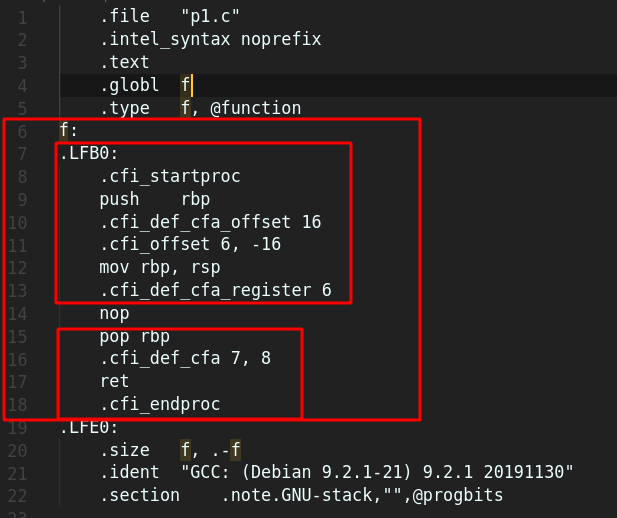
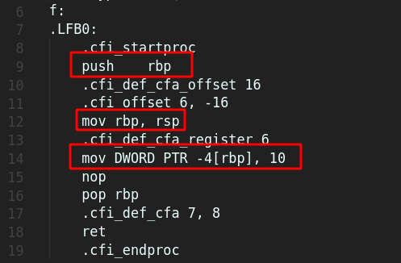

# Reversing 101

Reversing or in other words Reverse Engineering is basically looking at a "thing" and determining how that "thing" works. In our case for most of the time the "thing" will be a binary file. And we have to determine how it works and functions and what all stuffs it does by looking at the file itself. Most of the time we won't have the code. We have to reverse engineer the binary to get an idea of what the code might be. 

So, we will have with ourselves some very low level language code. Ofcourse we won't have just a binary file with 0s and 1s we will often time have some **assembly code**.

We will try to understand some basic assembly code instruction. All of them will be in x86 intel flavour

Simplest function in C:

[p1.c](files/p1/p1.c)

```c
void f(){
	return;
}
```

Now we will compile this C file with 

```
gcc -S p1.c -masm=intel
```

on doing `-S` it will generate a assembly code and `-masm=intel` will set it to intel flavour. Here is the file [p1.s](files/p1/p1.s)


We will be focussing of the bigger red rectangle for the time being. Because the rest are related to the binary file. Now one might wonder why there are so many lines of *gibberish* for a blank function. Actually for any function there are some parts:

1. Function Prologue
2. Function Epilogue
3. Function body.

For p1.c the function body is just the line num 14. `NOP`. For the time being let us consider that NOP instruction does nothing. It stands for `No Operation`. 


### Function Prologue
The function prologue is a few lines of code at the beginning of a function, which prepare the stack and registers for use within the function. 
A function prologue typically does the following actions if the architecture has a base pointer (also known as frame pointer `rbp`) and a stack pointer (aka `rsp`):

1. Pushes current base pointer onto the stack, so it can be restored later.
2. Assigns the value of base pointer to the address of stack pointer (which is pointed to the top of the stack) so that the base pointer will pointed to the top of the stack.
3. Moves the stack pointer further by decreasing or increasing its value, depending on whether the stack grows down or up. On x86, the stack pointer is decreased to make room for the function's local variables.

A typical x86 assembly language function prologue as produced by the GCC
```assembly
	push ebp
	mov	ebp, esp
	sub	esp, N
```
### Function Epilogue
The function epilogue appears at the end of the function, and restores the stack and registers to the state they were in before the function was called.

Function epilogue reverses the actions of the function prologue and returns control to the calling function. It typically does the following actions (this procedure may differ from one architecture to another):

1. Drop the stack pointer to the current base pointer, so room reserved in the prologue for local variables is freed.
2. Pops the base pointer off the stack, so it is restored to its value before the prologue.
3. Returns to the calling function, by popping the previous frame's program counter off the stack and jumping to it.

Source: [Function Prologue Wiki](https://en.wikipedia.org/wiki/Function_prologue)

Now, we have been talking pushing into **stack**, **stack** pointer. But what is stack?
"the stack" serves several purposes in the execution of a program:

1. Keeping track of where to return to, when calling a function
2. Storage of local variables in the context of a function call
3. Passing arguments from calling function to callee.


Let's look at the function prologue once again and try to understand the gibberish
```assembly
   push  ebp         ; Save the stack-frame base pointer(rbp) (of the calling function). (Pt 2. of stack's purpose)
   mov   ebp, esp    ; Set the stack-frame base pointer(rbp) to be the current location on the stack (rsp). (Pt 1. of stack's purpose)
   sub   esp, N      ; Grow the stack by N bytes to reserve space for local variables
```
But in the image of p1 we didn't see the last part where the stack grows. This is because we didn't allocate memory in that function. So take a look at the new program [p1_modified.c](files/p1/p1_modified.c) whose asm code is [p1_modified.s](files/p1/p1_modified.s).


There you can clearly see first base pointer being pushed then the base pointer moved to the current stack pointer. And then for this particulat case it not using the `SUB` but `mov	DWORD PTR -4[rbp], 10` does the same basically allocates the memory and assigns the value 10 to it. 


Now if you compare p1.c and [p2.c](files/p2/p2.c) there is a difference p2.c returns an int value. Now look at the asm code of p2.c i.1 [p2.s](files/p2/p2.s). On line  num 14 it does this `mov	eax, 10` basically it stores the value 10 in eax. By convention the return value is stored in eax. The caller will take the result from the EAX register.

Let's look at our final example, of [hello.c](files/hello_world/hello.c) and the asm code [hello.s](files/hello_world/hello.s)
This time after the function prologue we see a `LEA` function which stands for `Load Effective Address` basically computes the effective address of the second operand (the source operand) and stores it in the first operand (destination operand). So the address of "hello, world" if stored in `RDI` . RDI is one of the general purpose registers used for data copies. And after that `pts` is called, which is used under the `printf` function. So this is how some simple C code maps to asm code. 

The 64-bit versions of the 'original' x86 registers are named:

- rax - register a extended
- rbx - register b extended
- rcx - register c extended
- rdx - register d extended
- rbp - register base pointer (start of stack)
- rsp - register stack pointer (current location in stack, growing downwards)
- rsi - register source index (source for data copies)
- rdi - register destination index (destination for data copies)


### Ref
1. https://wiki.cdot.senecacollege.ca/wiki/X86_64_Register_and_Instruction_Quick_Start
2. https://cs.brown.edu/courses/cs033/docs/guides/x64_cheatsheet.pdf
3. https://lospi.net/developing/software/software%20engineering/reverse%20engineering/assembly/2015/03/06/reversing-with-ida.html